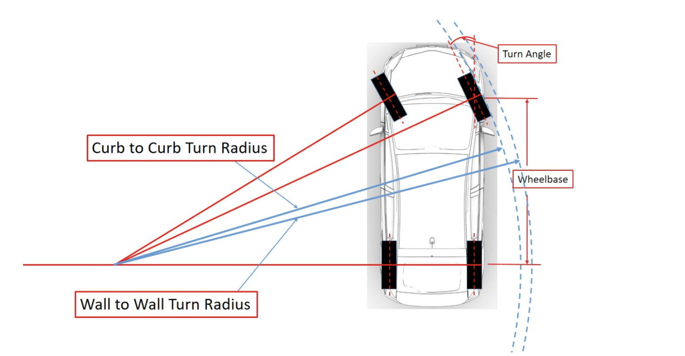
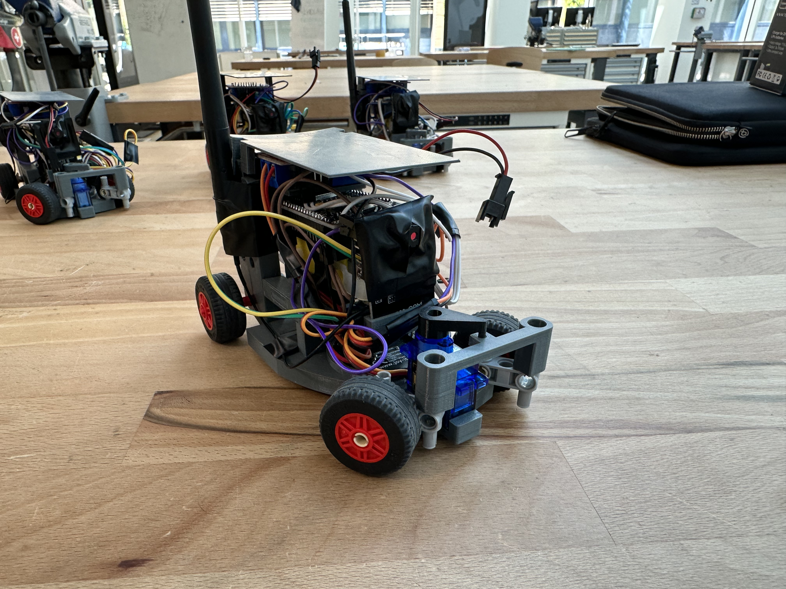
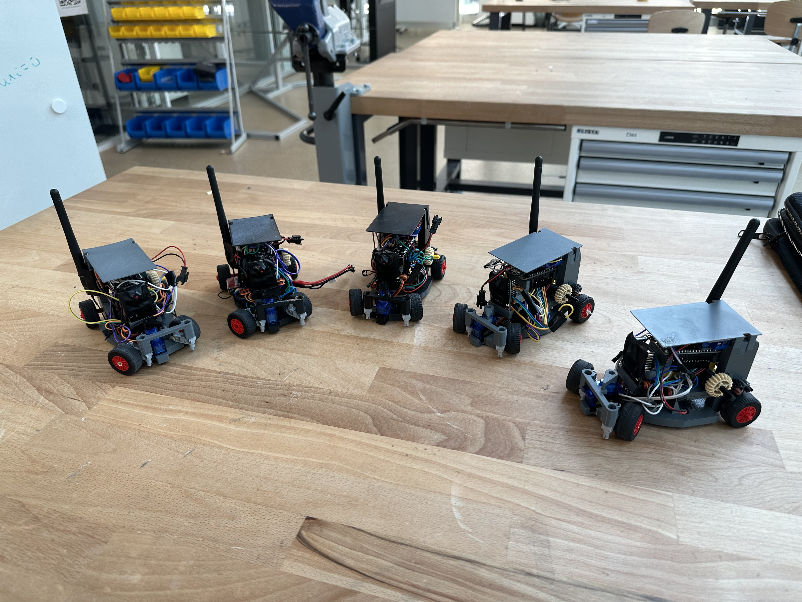
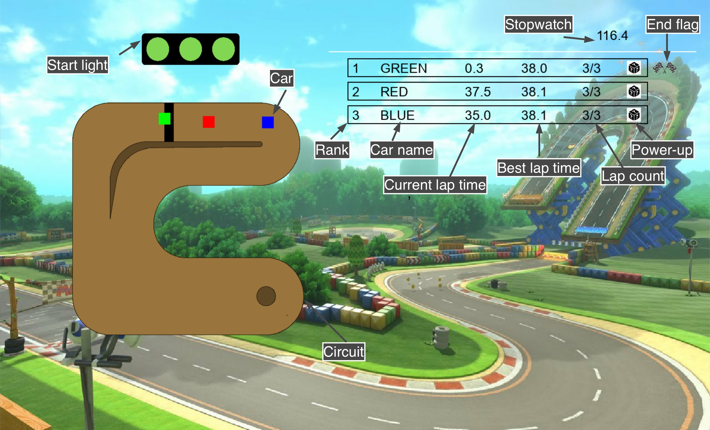

# Cars

## 3D-design
We have designed our cars using the software [Fusion 360](https://www.autodesk.fr/products/fusion-360/overview?term=1-YEAR&tab=subscription). The cars are composed of electronics, 3d printed parts and LEGO pieces. The first step was to import all the components into Fusion 360. For the electronic components, we have downloaded some existing models from the library [Crabcad](https://grabcad.com/library), listed below:

>- [ESP8266 board](https://grabcad.com/library/esp32-dev-kit-v1-1)
>- [ESP32-CAM board](https://grabcad.com/library/esp32-cam-1/details?folder_id=6305310)
>- [L298N motor driver](https://grabcad.com/library/l298n-17)
>- [Motor](https://grabcad.com/library/yellow-dc-motor-1)
>- [Servo](https://grabcad.com/library/sg90-micro-servomotor-1)

The color sensor and the battery are the only component for which we did not found a existing model. So we have precisely measured it and we have model it ourself.

We then imported the LEGO pieces. A good way of doing this is to use [BrinkLink Studio 2.0](https://www.bricklink.com/v3/studio/download.page). It's free, easy-to-use and it gives you access to a 3d model of all LEGO pieces. It also lets you assemble parts to build LEGOs directly within the application, but here we're only interested in the 3d model of the parts. Once we have selected the part we want in brinklink, we can't export it directly to Fusion 360. Here's how to do it:

>- In BrinkLing Studio 2.0, select File > Export As > "Collada" (.dae)
>- Use an online converter to convert your file from .dae to .stl. Here is a link to a converter: [Link](https://imagetostl.com/convert/file/dae/to/stl)
>- Import the file into Fusion 360
>- Rescale your lego part to a factor of exactly 0.04

Once all the parts have been imported. We were able to start designing the car. Design is a long and sometimes complicated process. The right solution doesn't come out on the first try, and sometimes you have to try again and again to get it right. There are a number of factors to take into account. In our case, we wanted the car to turn quickly. Which implies to have a small turning radius. One way of calculating it (approximately) is to measure the wheelbase (Wb), the steer angle (Sa) and the wheel width (Ww). The wheelbase is the distant beetween the front wheels and the rear wheels. The steering angle is the maximum angle at which the wheels can turn. 

[Image source](https://www.theautopian.com/the-engineering-behind-why-some-cars-can-turn-tighter-than-others/)

Once the measurements have been taken, we can calculate our turning radius (Tr) using this formula:   $Tr = \frac{Wb}{\sin(Sa)} + \frac{Ww}{2}$ 

Our car has a turning radius of 165.5 mm.

Here's a link if you want to know more about turning radius: [Link](https://en.wikipedia.org/wiki/Turning_radius)

Another important factor when building a car is the gearbox. Having a gearbox is essential and very useful for a car. When our engine runs, it runs at a certain speed and with a certain torque. In a nutshell Engine torque is the force of your motor's rotational movement. The more torque the engine has, the harder it is to stop. A gearbox is composed of gears, in our case LEGO gears, and is useful to turn the wheels using the motor. With a gearbox, we can do a reduction. A reduction implies that the wheels will rotate at a different speed than the motor. Reducing speed increases torque. And on the opposite, increasing speed reduces torque. If there isn't enough torque, the car won't move. So you need to find the right balance between the two. In our case we wanted the wheel to turn faster than the motor. This can be done by using a large gear on the motor followed by a smaller one. We used this [website](https://evolventdesign.com/pages/gear-ratio-calculator) to calculate the reduction. For our car, we have a 2.0833 gear ratio.

Taking these factors into account, we designed our car. Here's a timelapse of all the design process:

[Video Link](https://drive.google.com/file/d/1rE5q6M1Bsel_EN98zFcnqaiaQ2I-tCT6/view?usp=share_link)

Once the car has been designed, all that's left to do is print out the parts and build the car. 

To print the pieces, we used a Prusa printer (Original Prusa i3 MK3S & MK3S+) with a PETG filament. To use these printers, you need the [PrusaSlicer software](https://www.prusa3d.com/fr/page/prusaslicer_424/). Here are the steps to follow to print a part:

>- Select you part in Fusion 360 and click on "3d printing". Fusion 360 will then export an STL file.
>- Import the STL file into PrusaSlicer.
>- Click on "cut now". It will export a gcode file. 
>- Select the gcode file on your printer.

Of course there are a number of things to be careful about when printing. It's important to get the right settings. In our case, we used the default settings with a quality of 0.15 mm. It is also important to add support if necessary. When you need to print with support, you then have to remove it, which sometimes results in lower-quality parts. So we have designated our pieces to have to put on as little support as possible. We have divided our printing into 2 sets. The first set (Set_1_S) takes 4h42 and 39.18 g of filaments. The second set (Set_2_S) takes 4h13 and 37.89 g of filaments. Therefore a car takes a total of 8h55 and 77.07 g of filaments.

Here is a short animation showing how to assemble the car:

[Video Link](https://drive.google.com/file/d/1SugGETj4QmX7_Ma__iNNMzapm10kMvRc/view?usp=share_link)

Here are some photos:

Here is a video of the car driving:

[Video Link](https://drive.google.com/file/d/1jisL-YeDmEC7GNVOm17FnNlMF6QsF6Wv/view?usp=share_link)

For more details about the 3d model of the car, you can download the file LEGO - car.f3z from the repository.

# GUI

To make our project more complete, but also more fun to play, we decided to add a GUI (Graphical User Interface). Since
our server was already coded in python, using pygame seemed to be the best solution. 
## Interface
The interface is fairly simplistic. 

On the left, there is a map of the circuit. On this map, a colored square indicates the position of each car, and a color 
is associated with each car. Above the circuit is the start light. It is red at the first, and turns green when the race begins.

On the right, there's a classification. In the upper right-hand corner is a timer. The timer starts when the race begins. 
Below this is the ranking for each player. The number on the left corresponds to the player's position. Then the player's name. 
To the right of this is the player's lap time. This is a measure of the time it takes the player to complete a turn. This 
time resets to 0 each time the starting line is crossed, provided all checkpoints have been passed.  Then there's the player's 
best lap time. On the right is a lap counter. This shows the player the number of laps remaining. A lap is added each time 
the player crosses the start line and has passed all checkpoints. Next, the power-up is displayed. Each time the player has
a power-up, it is diplayed here with an image associated with each power-up. Finally, when the player has finished the race. 
That is, when he has completed the correct number of laps, a small flag is displayed, showing that the player has finished.

Here is a video showing the GUI with a game (without power_up):

[Video Link](https://drive.google.com/file/d/1Wopnna9PGnGgz63frg08rsFXboGv2CES/view?usp=sharing)

# Controller

For the controller, we first wanted to make a joystick on our phones. But with touch-sensitive joysticks, it was difficult
to be precise with the controls, and it was not that fun to play with. We then looked for a way to integrate physical controllers. 
and we found out that Pygame directly supports them. Since our server is coded in python, it was very easy to integrate 
the controllers using pygame. We simply use the module joystick from pygame. Note that this module supports xbox one and 
pro Switch controllers perfectly, but for reasons unknown we were unable to get ps4 controllers to work. 

